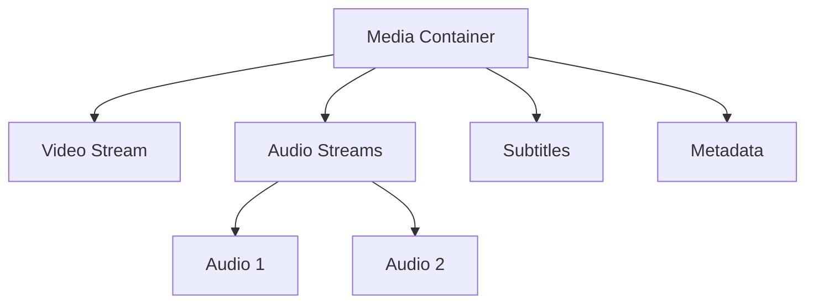
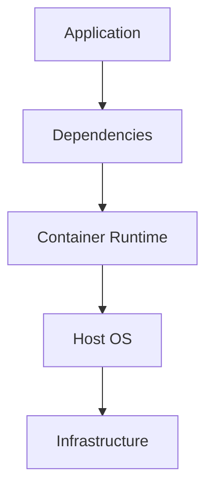

# Containers are Everywhere!

CSS Media Containers, Docker Containers, Web Containers?!

  
    <carbon:arrow-right class="inline"/>
  

  

  <a class="text-left ml-4 mt-2" href="https://github.com/sayjeyhi">
    <strong class="text-xl">Jafar Rezaei</strong>  
    Feb 2024
  </a>

---

# Overview

Understanding different types of containers in modern technology

- 📦 Media Containers
- 🐳 Docker Containers

## 🌐 Web Containers
Main focus for this presentation, powered by WebAssembly

---

# Why Talk About Containers?

- Containers are fundamental to modern technology
- They solve different problems in unique ways
- Understanding containers helps make better technical decisions
- Each type serves a specific purpose in the tech ecosystem

---

# Media Containers
## The Basics

- File formats that bundle multimedia content
- Package multiple streams into a single file
- Common examples: MP4, MKV, AVI
- Essential for digital media distribution

---

# Media Container Structure

- Video Stream
- Audio Stream(s)
- Subtitles
- Chapters
- Metadata
- Timestamps

---

# Media Container Benefits

- **Synchronization**: Keep audio and video in perfect sync
- **Organization**: Multiple streams in one file
- **Flexibility**: Support various codecs
- **Portability**: Easy to move and share
- **Metadata**: Store additional information

---

# Docker Containers
## Introduction

- Lightweight, standalone packages
- Contains everything needed to run an application
- Revolutionary approach to software deployment
- Industry standard for containerization

---

# Docker Container Architecture

---

# Docker Container Benefits

- Isolation
- Portability
- Consistency
- Efficiency
- Scalability

- Version Control
- Quick Deployment
- Resource Management
- Easy Updates
- Security

---

# Web Containers
## The New Frontier

- Run development environments in the browser
- Powered by WebAssembly
- Zero local setup required
- Revolutionary approach to web development

---

# How Web Containers Work

## Core Technologies
- WebAssembly (Wasm)
- Browser APIs
- Virtualization
- File System Simulation

## Key Features
- In-browser Execution
- Native-like Performance
- Secure Sandboxing
- Cross-platform Support

---

# WebAssembly's Role

- Enables near-native performance
- Supports multiple programming languages
- Provides secure execution environment
- Bridges native and web applications
- Powers complex in-browser applications

---

# Real-World Examples

- **bolt.new**: Full-stack development environment
- **Figma**: Collaborative design tool
- **Autodesk Fusion 360**: 3D modeling
- **Canva**: Browser-based design platform

---

# Use Cases for Web Containers

## Development
- Interactive coding
- Rapid prototyping
- Code sharing
- Live collaboration

## Education
- Programming tutorials
- Interactive learning
- Instant setup
- Real-time feedback

---

# Advantages of Web Containers

- No local setup required
- Instant access from any device
- Consistent environment
- Easy collaboration
- Resource efficiency

---

# Limitations of Web Containers

- Browser dependency
- Performance constraints
- Limited access to local resources
- Internet connectivity required
- Complex architecture

---
layout: center
class: text-center
---

# Demo time!

#### Let's see a Web Container in action...

---

# Pricing Models

## Common Models
- Freemium
- Subscription
- Pay-as-you-go
- Enterprise licensing

## Factors
- Usage volume
- Features needed
- Team size
- Support level

---

# Container Comparison

|Feature|Media Containers|Docker Containers|Web Containers|
|-------|---------------|-----------------|--------------|
|Purpose|Content delivery|App deployment|Browser execution|
|Technology|Codecs|OS virtualization|WebAssembly|
|Benefit|Unified media|Portability|Instant dev env|
|Use Case|Media playback|App deployment|Web development|

---

# Media Containers Deep Dive

- **Popular Formats**
  - MP4: Universal compatibility
  - MKV: Flexibility and features
  - AVI: Legacy support
- **Use Cases**
  - Streaming services
  - Digital distribution
  - Media archiving

---

# Docker Containers Deep Dive

- **Key Components**
  - Dockerfile
  - Images
  - Containers
  - Registry
- **Ecosystem**
  - Docker Hub
  - Kubernetes
  - Docker Compose

---

# Web Containers Deep Dive

- **Architecture**
  - Browser runtime
  - Virtual file system
  - Network simulation
  - Process management
- **Integration**
  - IDE features
  - Git support
  - Package management

---

# Security Considerations

## Media Containers
- DRM support
- Content protection
- Format validation

## Docker & Web Containers
- Isolation
- Vulnerability scanning
- Access control
- Resource limits

---

# Performance Comparison

- **Media Containers**: Optimized for streaming
- **Docker Containers**: Near-native performance
- **Web Containers**: Browser-dependent performance
- Trade-offs and considerations
- Use case-specific requirements

---

# Future Trends

- Enhanced browser capabilities
- Improved WebAssembly performance
- Hybrid container solutions
- New use cases emerging
- Evolution of standards

---

# Best Practices

## Selection
- Understand requirements
- Consider limitations
- Evaluate alternatives
- Plan for scaling

## Implementation
- Follow standards
- Monitor performance
- Regular updates
- Security first

---

# Integration Strategies

- Combining container types
- Hybrid approaches
- Migration paths
- Compatibility considerations
- Performance optimization

---

# Tools and Resources

## Development
- IDEs
- CLI tools
- SDKs
- Documentation

## Monitoring
- Performance tools
- Analytics
- Debugging
- Logging

---

# Case Studies

- Successful implementations
- Lessons learned
- Common pitfalls
- Best practices
- Real-world impact

---

# Getting Started

1. Identify your needs
2. Choose the right container type
3. Start with simple examples
4. Gradually add complexity
5. Learn from the community

---

# Resources & Learning

- Official documentation
- Community forums
- Online courses
- Books and tutorials
- Practice projects

---
layout: center
class: text-center
---

# Questions?

Thank you for your attention!

 
 

[GitHub](https://github.com/sayjeyhi) · [Contact](mailto:sayjeyhi@gmail.com)
